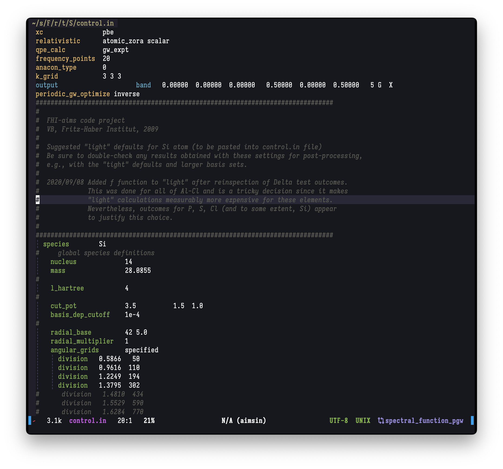
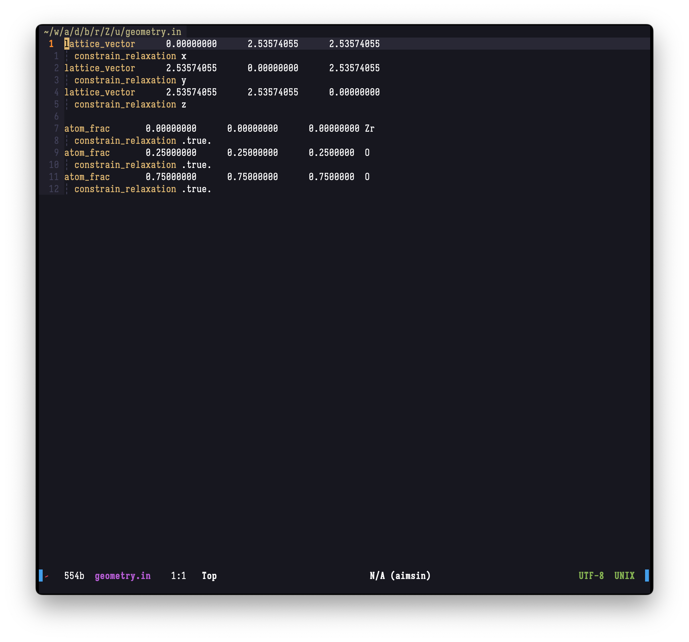

# Vim extension for FHI-aims input files

Filetype detection and syntax highlighting for [FHI-aims](https://fhi-aims.org/) input files.
This is useful for quick check of invalid keywords.

**N.B.**: the list of keywords is not complete.

## Screenshots

control file


geometry file


## Prerequisites

- Python 3
- [PyYAML](https://pyyaml.org/wiki/PyYAMLDocumentation)

## Usage

1. Clone this repository to vim configuration repository, e.g. "~/.vim/after"
2. Run

   ```shell
   python3 generate.py
   ```

3. By default it will create 3 files (also create directory when necessary)
   - `ftdetect/aimsin.vim`
   - `ftplugin/aimsin.vim`
   - `syntax/aimsin.vim`

   The file name `aimsin` can be changed by option `--filetype` of `generate.py`

## Example use

Assume the prerequisites are satisfied.

Vim
```shell
mkdir -p ~/.vim/after
cd ~/.vim/after
git clone https://github.com/minyez/vim-aims-input
cd vim-aims-input
python3 generate -d ..
```

NeoVim
```shell
mkdir -p ~/.config/nvim/after
cd ~/.config/nvim/after
git clone https://github.com/minyez/vim-aims-input
cd vim-aims-input
python3 generate -d ..
```
